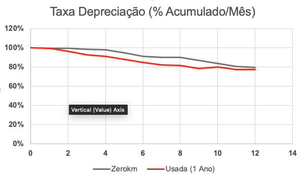

# Case Processo Seletivo
Este Repositório tem como objetivo descrever o case do processo seletivo para a Brick Seguros.

## Skillset
O case tem como principal intuito avaliar algumas capacidades que serão utilizadas de forma recorrente na sua jornada na área de dados da Brick. Para isso, o case é divido em etapas e níveis de complexidade: cada canditado deve realizar o case até o nível que achar pertinente com o estado atual de seu conhecimento.

As skills a serem testadas em cada etapa são as seguintes:
- Extração, normalizaçnao e enriquecimento de dados
- Modelagem e treinamento de modelos de ML/DL para previsão da variável resposta
- Deploy, serving e life cycle managing dos modelos

## O Problema a ser resolvido
Você se chama James, você é um gestor de frotas e gostaria de provisionar o valor de depreciação dos veículos da sua frota ao longo do tempo.

Hoje você usa uma média fixa de depreciação para seus veículos, independente de c=marca, tipo, categoria, modelo ou qualquer outra variável.

Sua frota é composta por veículos zero km e veículos comprados usados. Conforme gráfico abaixo, em um cenário real, a taxa de desvalorização dos ativos é diferente para veículos zero km e usados.

 
 

 Você contará com a Brick para prever a depreciação dos seus veículos em um determinado período, dado os seguintes inputs:
 - Código FIPE do veículo e ano do modelo
 - Mês e ano de compra do veículo
 - Comprado Zero km, ou, se não, qual mês e ano de compra.
 - Mês e ano de venda estimado do veículo

 O output deve ser a curva de depreciação acumulada do ativo ao final do período especificado.

 OBS: Utilizar dados somente de Carros e Utilitários, sem necessidade de caminhões e motos 

## Etapas do case

  
Etapa 1: Extração e limpeza de dados

  - Nível 1: Extrair dados da WEB de forma performática usando frameworks de WebScraping (Recomendado uso do Scrapy), normalizar e armazenar
  - Nível 2: Enriquecer os dados para melhorar a capacidade preditiva do modelo (tipo do veículo, potência, peso, combustível...)
  - Nível 3: Utilizar pipelines para orquestar atualizações destes dados mensalmente

  
Etapa 2: Criação de modelo preditivo

  - Nível 1: Treinar modelo para previsão da depreciação acumulada no período disposto pelo usuário
  - Nível 2: Comparar diferentes tipos de modelo e arquiteturas de NNs para obter o melhor resultado

  
Etapa 3: Serving do modelo

  - Nível 1: Servir o modelo para o usuário final em uma interface (Streamlit, Dash...)
  - Nível 2: Estabelecer pipeline de retreino e atualização dos modelos, com acompanhamento de métricas, challenging model, etc...

  
Etapa Extra: Deploy em Cloud

  - Fazer deploy da arquitetura em alguma Cloud

## Referências
- Para extração dos valores de FIPE dos veíiculos: https://veiculos.fipe.org.br/ ou https://brasilapi.com.br/docs#tag/FIPE/paths/~1fipe~1marcas~1v1~1{tipoVeiculo}/get

- Para enriquecimento das informações dos veículos: https://tabelacarros.com/ (Grupo de Modelos e Categoria do veiculo)

- Informações adicionais de veículos: https://www.mobiauto.com.br/tabela-fipe/carros/marcas (Dimensões, Potência, itens de série...)

- Intro ao Scrapy: https://www.youtube.com/watch?v=mBoX_JCKZTE

- High performance Scraing (Browser Mimiking): https://www.youtube.com/watch?v=myHHRAXxhmk

- Artigo sobre NNs e Preços de carros usados: https://www.mdpi.com/2071-1050/14/15/8993

### Glossário
- Depreciação: Perda de velor de um ativo ao longo do tempo

